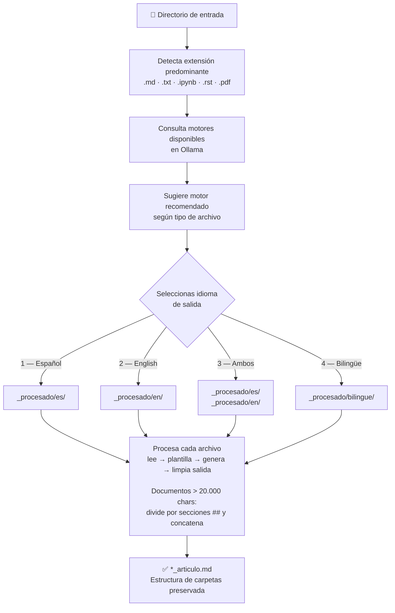
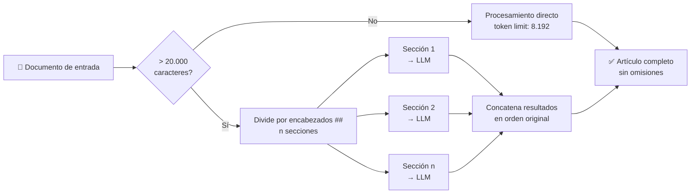

> [English version available → README.en.md](README.en.md)

# Generador de Artículos desde Notas Técnicas

Transforma notas técnicas desorganizadas en artículos profesionales listos para publicar. Funciona completamente en local, sin servicios externos, sin límites de uso y sin enviar tus datos a ningún servidor de terceros.

---

## Para qué sirve

Si tienes apuntes, notas de Joplin, notebooks de Jupyter o cualquier archivo de texto con contenido técnico y quieres convertirlos en artículos bien estructurados (al estilo Medium, Dev.to o un blog corporativo), este script hace ese trabajo de forma automática.

**Ejemplos de uso real:**

- Tienes carpetas de apuntes en Markdown sobre Docker, SQL o Machine Learning y quieres publicarlos en un blog.
- Exportas tus notas de Joplin y quieres convertirlas en artículos con introducción, ejemplos, troubleshooting y conclusión.
- Tienes notebooks de Jupyter con experimentos y quieres generar documentación legible para tu equipo.
- Procesas en batch decenas de archivos de una vez, sin supervisión manual.

---

## Flujo de trabajo



Para cada archivo se aplica una plantilla de instrucciones con estructura obligatoria de 8 secciones (título, introducción, conceptos, práctica, ejemplos, pro tips, troubleshooting y conclusión) y criterios de calidad mínimos (1200-1500 palabras, bloques de código, 5+ mejores prácticas).

---

## Los dos scripts del proyecto

| Script | Versión | Descripción |
|---|---|---|
| `generar_articulos_folders.py` | v1.0 | Original. Solo `.md`, motor fijo por variable de entorno, plantilla básica. |
| `generar_articulos_mejorado.py` | v6.0 | Versión actual. Selección de idioma, motor interactivo, soporte multi-formato, diagramas Mermaid, documentos extensos sin omisión de contenido. |

---

## Novedades de la versión 6.0

### 1. Soporte de diagramas Mermaid
El script detecta automáticamente bloques ` ```mermaid ``` ` en los archivos de entrada y reconoce 16 tipos de diagrama:

| Tipo | Descripción |
|---|---|
| `flowchart` / `graph` | Diagrama de flujo o grafo |
| `sequenceDiagram` | Interacciones entre componentes |
| `classDiagram` | Estructura orientada a objetos |
| `erDiagram` | Modelo de datos (entidad-relación) |
| `gantt` | Planificación temporal de tareas |
| `pie` | Distribución proporcional |
| `stateDiagram` | Estados y transiciones |
| `mindmap` | Mapa mental jerárquico |
| `journey` | Experiencia de usuario |
| `gitgraph` | Historial de ramas Git |
| `xychart-beta` | Gráfico de barras/líneas |
| `block-beta` | Arquitectura en bloques |
| `quadrantChart` | Clasificación en cuadrantes |
| `timeline` | Línea de tiempo |
| `zenuml` | Diagrama ZenUML |

Para cada diagrama encontrado el motor:
- Conserva el bloque `mermaid` exactamente como está (se renderizará en cualquier visor compatible).
- Añade inmediatamente después un párrafo de **Análisis del diagrama** explicando sus elementos, relaciones y relevancia.

### 2. Cobertura completa del contenido
En versiones anteriores documentos extensos podían sufrir omisiones silenciosas. La v6.0 incluye un bloque de instrucciones explícito que:
- Lista todos los encabezados del documento original y exige que cada uno quede cubierto en el artículo.
- Prohíbe expresamente frases como "se omite por brevedad" o "ver documento original".
- Aumenta el límite de tokens de salida a **8 192** para artículos individuales y **16 384** para bilingüe.

### 3. Procesamiento por secciones para documentos extensos
Si el documento de entrada supera **20 000 caracteres**, el script lo divide automáticamente en secciones usando los encabezados `##` como puntos de corte naturales. Cada sección se procesa de forma independiente y los resultados se concatenan en el artículo final. Esto evita truncados y garantiza que ningún fragmento del original quede sin tratar.



### 4. Contexto ampliado
Se añade el parámetro `num_ctx: 16384` a todas las llamadas, ampliando la ventana de contexto activa del motor para manejar documentos técnicos densos sin perder información de las secciones anteriores.

---

## Novedades de la versión 4.0

### 1. Selección de idioma de salida
Lo primero que pregunta el script es en qué idioma quieres los artículos:

```
================================================================================
IDIOMA DE SALIDA
================================================================================

  1. Español                          → <dir>_procesado/es/
  2. English                          → <dir>_procesado/en/
  3. Ambos / Both (ES + EN separados) → <dir>_procesado/es/  y  /en/
  4. Bilingüe mejorado (ES + EN en un archivo) → <dir>_procesado/bilingue/

Elige el idioma de salida [1/2/3/4]:
```

Según la elección, los artículos se guardan en subdirectorios específicos:

| Opción | Directorio | Descripción |
|---|---|---|
| 1 – Español | `<dir>_procesado/es/` | Un artículo en español por archivo |
| 2 – English | `<dir>_procesado/en/` | Un artículo en inglés por archivo |
| 3 – Ambos | `<dir>_procesado/es/`  y  `<dir>_procesado/en/` | Dos pasadas independientes, un directorio por idioma |
| 4 – Bilingüe | `<dir>_procesado/bilingue/` | Un solo archivo con las dos versiones mejoradas |

Con la opción **3 – Ambos**, cada archivo se procesa dos veces: primero la versión en español, luego la versión en inglés.

Con la opción **4 – Bilingüe mejorado**, cada archivo se procesa en **una sola llamada**: el motor escribe primero el artículo completo en español, luego el artículo completo en inglés. Ambas versiones son independientes y se enriquecen mutuamente (no son traducciones literales). El archivo resultante lleva el sufijo `_bilingue.md` y contiene ambas versiones separadas por un divisor Markdown. El parámetro de longitud de salida se duplica (8192 tokens) para que el motor tenga espacio para los dos artículos completos.

### 2. Selección interactiva de motor
La v1.0 usaba siempre el motor definido en `OLLAMA_MODEL`. La v4.0 consulta Ollama en tiempo real y muestra un menú:

```
  Motores disponibles:

    1. huihui_ai/deepseek-r1-abliterated:14b
    2. qwen2.5:14b-instruct-q5_K_M
    3. mistral:latest
    4. qwen3:14b
    5. gemma3:12b
    6. deepseek-r1:14b  <-- RECOMENDADO

    0. Usar recomendado  (deepseek-r1:14b)
```

### 3. Recomendación por tipo de archivo
El script analiza el directorio de entrada, detecta qué extensión predomina y recomienda el motor más adecuado:

| Tipo de archivo | Motor recomendado | Motivo |
|---|---|---|
| `.md` | `deepseek-r1:14b` | Notas técnicas → análisis en profundidad |
| `.ipynb` | `deepseek-r1:14b` | Notebooks con código → análisis en profundidad |
| `.txt` | `qwen2.5:14b-instruct` | Texto plano → multilingüe y preciso |
| `.rst` | `qwen2.5:14b-instruct` | Documentación estructurada |
| `.pdf` | `qwen2.5:14b-instruct` | PDF con texto → instrucción precisa y multilingüe |

### 4. Limpieza automática de salida
Algunos motores incluyen en su respuesta un bloque interno de procesamiento entre etiquetas `<think>...</think>`. El script lo detecta y lo elimina automáticamente antes de guardar el artículo.

### 5. Soporte de más formatos
- **v1.0:** solo archivos `.md`
- **v4.0:** `.md`, `.txt`, `.rst` y `.ipynb` (los notebooks de Jupyter se extraen celda a celda, separando secciones de texto y bloques de código)
- **v5.0:** añade `.pdf` — extrae texto y tablas página a página con `pdfplumber`; las tablas se convierten a Markdown automáticamente; si alguna página no tiene capa de texto (escaneados) se omite con un aviso

### 6. Plantilla de instrucciones mejorada
La plantilla incluye estructura de 8 secciones obligatorias, criterios de calidad explícitos y reglas según el tipo de contenido (tutorial, concepto, código, configuración).

### 7. Mejor manejo de errores
- Detecta archivos vacíos y los omite con aviso
- Distingue errores de conexión, errores del motor y archivos problemáticos
- Muestra estadísticas al final: procesados correctamente vs. errores

---

## Requisitos

### Software necesario

| Requisito | Versión mínima | Para qué |
|---|---|---|
| Python | 3.8+ | Ejecutar el script |
| [Ollama](https://ollama.com) | cualquiera | Motor de procesamiento local |
| curl | cualquiera | Comunicación con Ollama |
| pdfplumber *(opcional)* | 0.9+ | Leer archivos PDF |

El script usa únicamente módulos de la biblioteca estándar para los formatos de texto. Para PDF se necesita `pdfplumber`:

```bash
pip install pdfplumber
```

Si `pdfplumber` no está instalado el script arranca igualmente, simplemente ignorará los archivos `.pdf` y el arranque mostrará un aviso con el comando de instalación.

### Motores disponibles

Necesitas tener al menos un motor instalado en Ollama. Los probados con este script:

```bash
ollama pull deepseek-r1:14b           # Análisis técnico en profundidad
ollama pull qwen2.5:14b-instruct      # Muy bueno en español, multilingüe
ollama pull gemma3:12b                # Equilibrado, versátil
ollama pull mistral                   # Ligero y rápido
ollama pull qwen3:14b                 # Última generación Qwen
```

El script excluye automáticamente los motores especializados en incrustaciones (como `nomic-embed-text`) porque no son aptos para generación de texto.

### Hardware recomendado

Los motores de 14B parámetros funcionan con velocidad razonable en una GPU con al menos 10 GB de VRAM. Ollama también puede usar CPU+RAM (más lento). Los motores más ligeros como Mistral (~4 GB) funcionan bien en hardware modesto.

---

## Instalación

```bash
# 1. Clonar o copiar el repositorio
git clone <este-repositorio>
cd crear_articulos

# 2. Verificar que Ollama está activo
ollama list

# 3. (Opcional) Descargar los motores que quieras usar
ollama pull deepseek-r1:14b

# 4. Listo, no hay que instalar nada más
```

---

## Uso

```bash
python3 generar_articulos_mejorado.py <directorio_de_entrada>
```

**Ejemplo con carpeta de apuntes:**

```bash
python3 generar_articulos_mejorado.py mis_notas/
```

El script crea automáticamente `mis_notas_procesado/es/` o `mis_notas_procesado/en/` (según el idioma elegido) con la misma estructura de subcarpetas del original, añadiendo el sufijo `_articulo.md` a cada archivo.

**Usando Ollama en otra máquina de la red:**

```bash
OLLAMA_HOST=http://192.168.1.100:11434 python3 generar_articulos_mejorado.py mis_notas/
```

### Ejemplo de sesión completa

```
================================================================================
GENERADOR DE ARTICULOS - VERSION 4.0
================================================================================
  OLLAMA_HOST       : http://localhost:11434
  Directorio entrada: mis_notas/
  Directorio salida : mis_notas_procesado/<idioma>/

================================================================================
IDIOMA DE SALIDA
================================================================================

  1. Español
  2. English
  3. Ambos / Both  (genera ES + EN, dos directorios)

Elige el idioma de salida [1/2/3]: 1

[OK] Idioma seleccionado: Español

Consultando motores disponibles...
Motores encontrados: 6

================================================================================
SELECCION DE MOTOR
================================================================================

  Tipo de archivo detectado : .md
  Motor recomendado         : deepseek-r1:14b
  Motivo                    : notas tecnicas Markdown → analisis en profundidad

  Motores disponibles:

    1. huihui_ai/deepseek-r1-abliterated:14b
    2. qwen2.5:14b-instruct-q5_K_M
    3. mistral:latest
    4. qwen3:14b
    5. gemma3:12b
    6. deepseek-r1:14b  <-- RECOMENDADO

    0. Usar recomendado  (deepseek-r1:14b)

Elige el numero del motor [0 para recomendado]: 0

[OK] Usando motor recomendado: deepseek-r1:14b

================================================================================
INICIO DE PROCESAMIENTO
================================================================================

Motor activo    : deepseek-r1:14b
Limpieza salida : SI
Extensiones     : .ipynb, .md, .rst, .txt
Idioma(s)       : ES
Salida base     : mis_notas_procesado/

[1] [ES] mis_notas/docker/instalacion.md
     [OK] -> mis_notas_procesado/es/docker/instalacion_articulo.md
          Tiempo: 47.3s  |  Palabras: 1342  |  Chars: 8891

[2] [ES] mis_notas/sql/joins.md
     [OK] -> mis_notas_procesado/es/sql/joins_articulo.md
          Tiempo: 52.1s  |  Palabras: 1487  |  Chars: 9654

================================================================================
PROCESAMIENTO FINALIZADO
================================================================================
  Procesados correctamente : 2
  Errores / omitidos       : 0
  Directorio(s) de salida  :
    mis_notas_procesado/es/
```

---

## Estructura del artículo generado

La plantilla de instrucciones define siempre esta estructura:

1. **Título y subtítulo** — atractivo, 60-70 caracteres
2. **Introducción** — 150-200 palabras, empieza con un problema o pregunta real
3. **Conceptos básicos** — explicación con analogías del mundo real
4. **Sección práctica** — pasos numerados o subsecciones temáticas con código
5. **Ejemplos prácticos** — mínimo 2-3, con entrada/proceso/salida esperada
6. **Pro Tips** — mínimo 5 mejores prácticas (rendimiento, seguridad, escalabilidad)
7. **Troubleshooting** — errores comunes en formato `[ERROR] | Causa | Solución`
8. **Resumen y llamado a la acción** — próximo paso recomendado

---

## Ventajas

| Aspecto | Este script | Servicios externos |
|---|---|---|
| Coste | Gratis | Suscripción o pago por uso |
| Privacidad | Datos 100% locales | Datos enviados a terceros |
| Límite de uso | Sin límite | Cuotas y restricciones |
| Personalización | Total | Limitada |
| Funcionamiento sin internet | Sí | No |
| Procesamiento en batch | Sí, sin restricciones | Sujeto a límites |

---

## Preguntas frecuentes

**¿Necesito entorno virtual de Python (venv/conda)?**
No. El script no tiene dependencias externas. Funciona con el Python del sistema directamente.

**¿Funciona en Windows?**
El script usa `curl` y rutas de archivo estándar, por lo que funciona en Linux y macOS sin cambios. En Windows funcionaría con WSL o si `curl` está disponible en el PATH.

**¿Puedo procesar miles de archivos?**
Sí. El script recorre recursivamente el directorio de entrada. El tiempo depende del motor elegido: típicamente 30-90 segundos por archivo en una GPU de gama media.

**¿Qué pasa si un archivo está vacío o tiene muy poco contenido?**
El script lo detecta, muestra un aviso y lo omite. Al final muestra el conteo de archivos omitidos.

**¿Puedo cambiar la plantilla de instrucciones?**
Sí. La plantilla completa está en la función `generar_articulo_con_ollama()` dentro de `generar_articulos_mejorado.py`. Puedes ajustar el tono, la longitud, el idioma o la estructura.

**¿Y si Ollama está en otra máquina de la red?**
Usa la variable de entorno `OLLAMA_HOST`:
```bash
OLLAMA_HOST=http://192.168.1.50:11434 python3 generar_articulos_mejorado.py notas/
```
